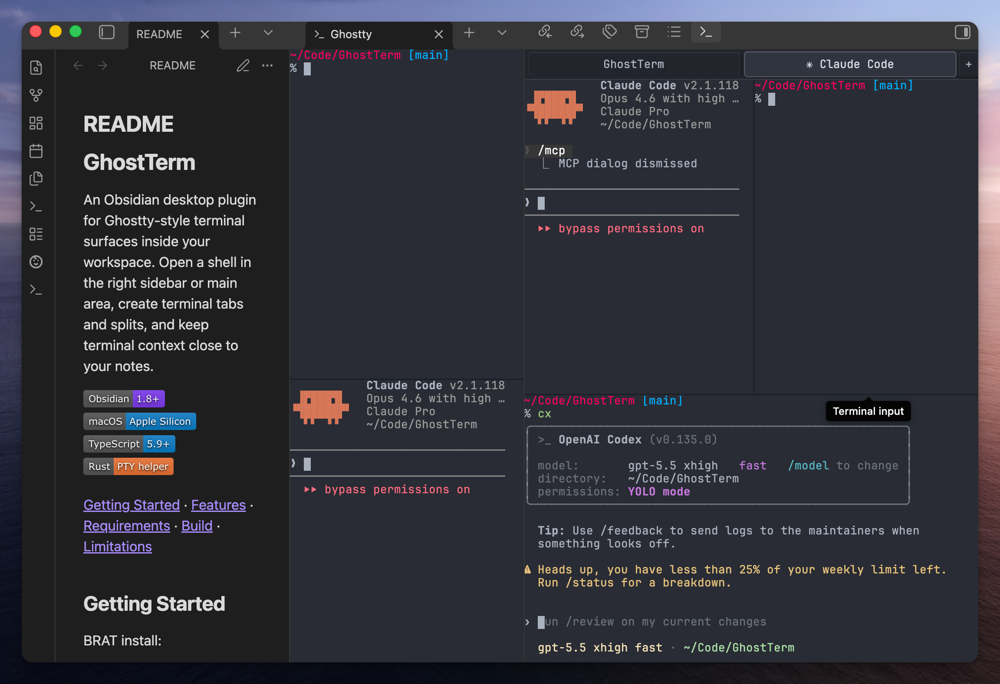

# GhostTerm

An Obsidian desktop plugin for Ghostty-style terminal surfaces inside your workspace. Open a shell in the right sidebar or main area, create terminal tabs and splits, and keep terminal context close to your notes.


[Getting Started](#getting-started) · [Features](#features) · [Requirements](#requirements) · [Security](#security-and-privacy) · [Build](#build-commands) · [Limitations](#limitations)



## Getting Started

Install from the Obsidian Community directory:

1. Open <https://community.obsidian.md/plugins/ghostterm>.
2. Select **Add to Obsidian**.
3. Enable GhostTerm in Obsidian's community plugin settings.
4. Run `Open terminal` from the command palette.

You can also install from inside Obsidian by opening **Settings -> Community plugins -> Browse** and searching for `GhostTerm`. If the in-app browser has not refreshed yet, use the web listing above.

BRAT beta install:

1. In BRAT, add `andyhtran/GhostTerm`.
2. Select the latest release. No GitHub token is required for this repository.
3. Enable GhostTerm in Obsidian's community plugin settings.
4. Run `Open terminal` from the command palette.

On first terminal start, GhostTerm writes its bundled PTY helper into the installed plugin directory. BRAT only needs the standard Obsidian plugin files from the release.

Manual install:

1. Download these files from the [latest GitHub release](https://github.com/andyhtran/GhostTerm/releases/latest):

   ```text
   main.js
   manifest.json
   styles.css
   ```

2. Copy the files into `<vault>/.obsidian/plugins/ghostterm/`.

3. Enable GhostTerm in Obsidian's community plugin settings.

Build from source:

1. Build GhostTerm:

   ```bash
   npm install
   npm run build
   ```

2. Copy these files into `<vault>/.obsidian/plugins/ghostterm/`:

   ```text
   manifest.json
   styles.css
   dist/main.js -> main.js
   ```

3. Enable GhostTerm in Obsidian's community plugin settings.

## Features

- **Terminal surface in Obsidian** — open a Ghostty-style terminal in the sidebar or main workspace
- **Tabs and splits** — create terminal tabs, split right, split down, close focused surfaces, and restart exited shells
- **Focused shortcut routing** — terminal shortcuts are intercepted only while a GhostTerm terminal surface is focused
- **Ghostty config subset** — reads font, color, cursor, scrollback, shell, and basic keybind settings from Ghostty config files
- **Working-directory context** — open a terminal from the file explorer and start in the selected folder or file parent
- **Shell environment repair** — prepares a terminal-like `PATH`, locale, `TERM`, dimensions, and shell environment for GUI-launched Obsidian
- **OSC metadata support** — tracks terminal title, current working directory, and OSC 8 hyperlinks

## Requirements

Runtime:

- Obsidian desktop 1.8+
- macOS on Apple Silicon
- A local shell available on the system

Build:

- Node.js and npm for building the plugin
- Rust toolchain for building the PTY helper

## Security and Privacy

GhostTerm starts a local shell through a bundled helper binary. Commands run with the same permissions as Obsidian and your user account. They can read, write, create, delete, or execute files that your user account can access.

GhostTerm supports terminal copy and paste through the system clipboard when you invoke terminal copy/paste shortcuts.

Use GhostTerm only in vaults and workspaces where running a local terminal is appropriate. Treat terminal output and shell commands with the same care you would in a standalone terminal application.

GhostTerm does not collect telemetry. GhostTerm does not require network access at runtime.

## Build Commands

```bash
npm install
npm run check
npm run build
```

The helper is built from `pty-helper/` and embedded into `dist/main.js` during `npm run build`.

## Components

GhostTerm includes TypeScript plugin code and a Rust PTY helper. The plugin writes the helper into the installed plugin directory when a terminal starts. JavaScript dependencies are declared in `package-lock.json`; Rust dependencies are declared in `pty-helper/Cargo.lock`.

## Limitations

- macOS Apple Silicon is the supported platform.
- Unsupported platforms show an in-plugin message and do not start the helper.
- Ghostty config support covers font, color, cursor, scrollback, shell, and basic keybind settings.
- The plugin is desktop-only because it starts local processes.

## License

[MIT](LICENSE)
